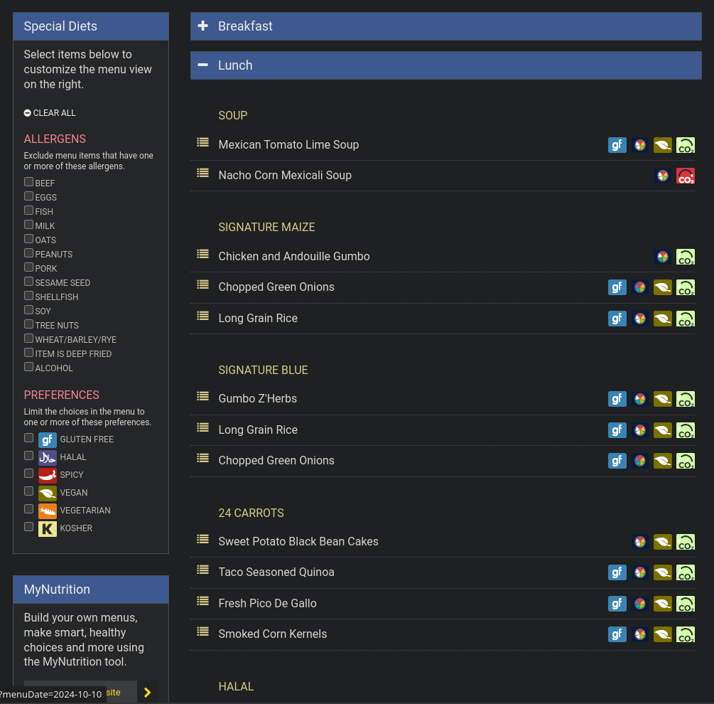
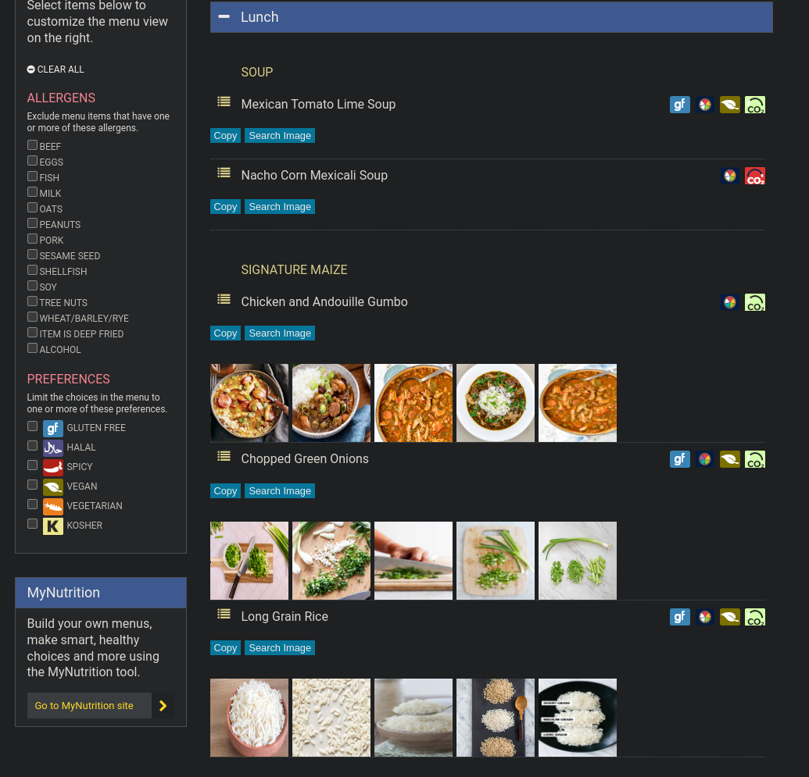

# visualize_bursley

Ever found yourself wondering if Bursley’s food is tasty today, but as a non-native speaker, you have no idea what "Chicken and Andouille Gumbo" looks like? Searching for each food item manually is tedious—**but this script saves the day!**

Before:

After:

## How It Works

- **Copy**: Instantly copies the food name to your clipboard.
- **Search Image**: Opens a Google Image search in a new tab.
- **Auto Image Search (with API Key, OPTIONAL)**:
  - [Get a Google API key for free](https://developers.google.com/custom-search/v1/introduction), and fill it in the API key input box in the bottom-right corner. The script will magically fetch food images from the sections "Signature Maize" and "Halal" and "Two Oceans" automatically.
  - The magic lasts for 100 requests per day for free!

## Installation

1. Install a userscript manager (like [Tampermonkey](https://www.tampermonkey.net/)).
2. Add the script from [visualize_bursley.user.js](https://github.com/zpatronus/visualize_bursley/raw/main/visualize_bursley.user.js).
3. Try it out at [Bursley's menu page](https://dining.umich.edu/menus-locations/dining-halls/bursley/).

## License

Licensed under the MIT License. See the [LICENSE](LICENSE) file for details.
